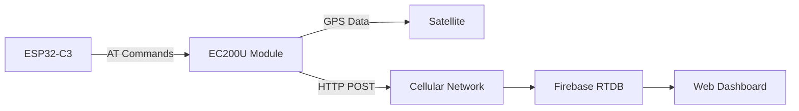

<div align="center">

# 🌐 OBM-IoT GPS Tracker

**Real-time GPS tracking system with Firebase cloud integration**

[](https://platformio.org/)
[](https://firebase.google.com/)
[](LICENSE)

[Features](#-features) • [Hardware](#%EF%B8%8F-hardware-requirements) • [Setup](#-quick-start) • [Configuration](#%EF%B8%8F-configuration) • [Troubleshooting](#-troubleshooting)

</div>

---

## 📋 Overview

An IoT GPS tracking solution that combines ESP32-C3 microcontroller with Quectel EC200U GSM/GPS module to capture and upload real-time location data to Firebase Realtime Database. Perfect for vehicle tracking, asset monitoring, and location-based IoT applications.

### ✨ Features

- 🛰️ **GPS Tracking** - Precise location data via Quectel EC200U module
- 📡 **GSM Connectivity** - Uses cellular network (Airtel GPRS/LTE)
- ☁️ **Cloud Integration** - Real-time data sync with Firebase RTDB
- ⚡ **Low Power** - Optimized for battery-powered applications
- 🔄 **Auto-Reconnect** - Handles network failures gracefully
- 📊 **Timestamped Data** - Firebase server-side timestamps for accuracy
- 🔒 **Secure** - Supports Firebase authentication

---

## 🛠️ Hardware Requirements

| Component | Model | Purpose |
|-----------|-------|---------|
| **Microcontroller** | ESP32-C3-DevKitM-1 | Main processing unit |
| **GSM/GPS Module** | Quectel EC200U | Cellular + GPS connectivity |
| **SIM Card** | Airtel (or compatible) | Network connectivity |
| **Power Supply** | 5V USB or LiPo | Device power |

### 🔌 Pin Connections

```
ESP32-C3          EC200U
--------          ------
GPIO 4 (RX)  →    TX
GPIO 5 (TX)  →    RX
GND          →    GND
5V           →    VCC
```

---

## 🚀 Quick Start

### Prerequisites

- [PlatformIO](https://platformio.org/) (VS Code extension or CLI)
- [Git](https://git-scm.com/)
- Firebase account with Realtime Database enabled
- Active SIM card with data plan

### 1. Clone Repository

```bash
git clone https://github.com/charles-shaju/OBM-IoT.git
cd OBM-IoT
```

### 2. Configure Secrets

**Important:** Create your own secrets file (not tracked by Git):

```bash
# Copy the template
cp include/secrets.example.h include/secrets.h
```

Edit `include/secrets.h` with your credentials:
```cpp
#define FIREBASE_URL "https://YOUR-PROJECT-ID-default-rtdb.firebaseio.com/gps.json"
#define DEVICE_ID "ESP32_001"  // Unique ID for this device
#define APN_NAME "your-apn-name"
```

> ⚠️ **Never commit `secrets.h` to Git!** It's already in `.gitignore`.

### 3. Firebase Setup

#### Get Firebase Credentials

1. Navigate to [Firebase Console](https://console.firebase.google.com/u/0/project/obm-gps)
2. Go to **Project Settings** (⚙️) → **General** tab
3. Scroll to **Your apps** → Copy **Web API Key**

#### Configure Database Rules

1. Open **Realtime Database** → **Rules** tab
2. Set rules for testing:

```json
{
  "rules": {
    "gps": {
      ".read": true,
      ".write": true
    }
  }
}
```

> ⚠️ **Security Note**: For production, implement proper authentication rules.

### 3. Configure Code

Edit `src/main.cpp` and update the Firebase URL (lines 12-13):

```cpp
String firebaseURL = "https://obm-gps-default-rtdb.firebaseio.com/gps.json";
```

**Optional**: Change APN for your carrier (line 46):

```cpp
sendAT("AT+QICSGP=1,1,\"airtelgprs.com\",\"\",\"\",1", "OK", 5000)
// Common APNs:
// Airtel: airtelgprs.com
// Jio: jionet
// Vodafone: www
```

### 4. Build & Upload

```bash
# Build the project
pio run

# Upload to ESP32-C3
pio run --target upload

# Open serial monitor (115200 baud)
pio device monitor
```

---

## ⚙️ Configuration

### Changing Update Interval

Default: 10 seconds. Modify in `loop()` function (line 64):

```cpp
if (millis() - lastSend >= 10000) {  // Change 10000 to desired milliseconds
```

### GPS Command Options

```cpp
AT+QGPS=1       // Start GPS (default)
AT+QGPS=2       // Start GPS + GLONASS
AT+QGPSLOC=2    // Get location (mode 2 = more details)
```

### Serial Debugging

Monitor output shows:
- GSM module initialization
- GPS fix status
- Data parsing
- Firebase upload success/failure

---

## 📊 Data Structure

Firebase stores GPS data in this format:

```json
{
  "gps": {
    "-NXyZ1234abcde": {
      "latitude": 12.9716,
      "longitude": 77.5946,
      "timestamp": 1700400000000
    }
  }
}
```

### View Live Data

Open Firebase Console:
- [https://console.firebase.google.com/u/0/project/obm-gps/database/obm-gps-default-rtdb/data](https://console.firebase.google.com/u/0/project/obm-gps/database/obm-gps-default-rtdb/data)

---

## 🔧 Troubleshooting

### GPS Not Getting Fix

**Symptoms**: `GPS Fix Not Available` in serial output

**Solutions**:
- ✅ Ensure antenna is connected to EC200U
- ✅ Place device outdoors or near window
- ✅ Wait 1-2 minutes for initial GPS lock
- ✅ Check GPS status: `sendAT("AT+QGPS?", "OK", 1000)`

### GSM Connection Failed

**Symptoms**: `FATAL: Failed to activate GPRS/LTE`

**Solutions**:
- ✅ Verify SIM card is inserted correctly
- ✅ Check SIM has active data plan
- ✅ Confirm APN settings for your carrier
- ✅ Check signal strength: `sendAT("AT+CSQ", "OK", 1000)` (10-31 = good)
- ✅ Test SIM registration: `sendAT("AT+CREG?", "OK", 1000)`

### Firebase Upload Fails

**Symptoms**: `ERROR: HTTP POST failed or non-200 status code`

**Solutions**:
- ✅ Verify Firebase URL is correct (must end with `.json`)
- ✅ Check database rules allow write access
- ✅ Ensure GSM has stable data connection
- ✅ Verify JSON format is valid (check Serial output)

### Module Not Responding

**Symptoms**: `FATAL: GSM module not responding`

**Solutions**:
- ✅ Check wiring connections (TX→RX, RX→TX)
- ✅ Verify power supply (EC200U needs stable 5V)
- ✅ Press reset button on ESP32-C3
- ✅ Check baud rate matches (115200)

### Compilation Errors

```bash
# Clean build directory
pio run --target clean

# Update platform and libraries
pio pkg update

# Rebuild
pio run
```

---

## 📁 Project Structure

```
OBM-IoT/
├── src/
│   └── main.cpp          # Main application code
├── include/              # Header files (if any)
├── lib/                  # Custom libraries
├── test/                 # Unit tests
├── platformio.ini        # PlatformIO configuration
└── README.md            # This file
```

---

## 🔄 How It Works



1. **Initialization**: ESP32 configures EC200U via AT commands
2. **GPS Acquisition**: EC200U locks onto GPS satellites
3. **Data Collection**: Parse GPS coordinates (lat/lon)
4. **Network Connection**: Establish GPRS/LTE via SIM card
5. **Upload**: HTTP POST JSON payload to Firebase
6. **Repeat**: Loop every 10 seconds

---

## 📝 AT Commands Reference

| Command | Purpose | Expected Response |
|---------|---------|-------------------|
| `AT` | Test connectivity | `OK` |
| `ATE0` | Disable echo | `OK` |
| `AT+QGPS=1` | Start GPS | `OK` |
| `AT+QGPSLOC=2` | Get GPS location | `+QGPSLOC: ...` |
| `AT+QICSGP=1,1,"apn",""` | Set APN | `OK` |
| `AT+QIACT=1` | Activate PDP context | `OK` |
| `AT+QHTTPURL=<len>` | Set HTTP URL | `CONNECT` |
| `AT+QHTTPPOST=<len>` | Send HTTP POST | `CONNECT` then `+QHTTPPOST: 0,200` |

Full reference: [Quectel EC200U AT Commands Manual](https://www.quectel.com/product/lte-ec200u-series)

---

## 🛡️ Security Best Practices

- 🔒 Never commit Firebase credentials to GitHub
- 🔐 Use environment variables for sensitive data
- 🔑 Enable Firebase authentication in production
- 🚫 Restrict database rules to authenticated users only
- 📋 Regularly rotate API keys

Example production rules:
```json
{
  "rules": {
    "gps": {
      ".read": "auth != null",
      ".write": "auth != null && auth.uid == 'y7RYa9aDJYSajk3XHO7P5wslty92'"
    }
  }
}
```

---

## 🤝 Contributing

Contributions are welcome! Please:

1. Fork the repository
2. Create a feature branch (`git checkout -b feature/NewFeature`)
3. Commit changes (`git commit -m 'Add NewFeature'`)
4. Push to branch (`git push origin feature/NewFeature`)
5. Open a Pull Request

---

## 📄 License

This project is licensed under the MIT License - see [LICENSE](LICENSE) file for details.

---

## 👨‍💻 Author

**Charles Shaju**
- GitHub: [@charles-shaju](https://github.com/charles-shaju)
- Project: [OBM-IoT](https://github.com/charles-shaju/OBM-IoT)

---

## 📞 Support

- 📧 **Issues**: [GitHub Issues](https://github.com/charles-shaju/OBM-IoT/issues)
- 📖 **Documentation**: [Wiki](https://github.com/charles-shaju/OBM-IoT/wiki)
- 💬 **Discussions**: [GitHub Discussions](https://github.com/charles-shaju/OBM-IoT/discussions)

---

<div align="center">

**⭐ Star this repo if you found it helpful!**

Made with ❤️ for the IoT community

</div>
